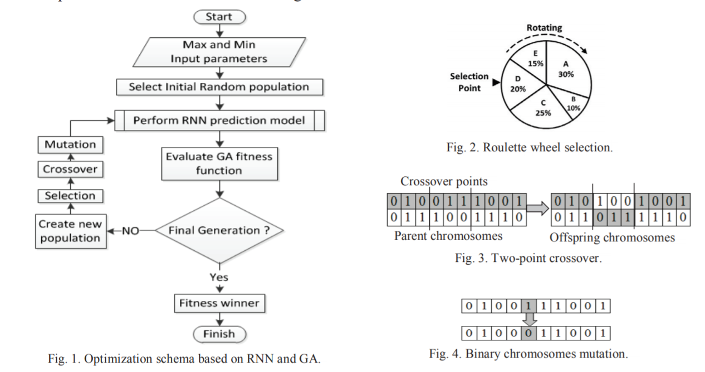

By
Procedia Computer Science 16
	https://www.sciencedirect.com/science/article/pii/S1877050916317835

	• QoE-aware Optimization of Video Stream Downlink Scheduling over LTE Networks using RNNs and Genetic Algorithm 
		○ traffic scheduling: ability to select optimal parameters and appropriate scheduling to obtain best QoS
			§ maximizing Mean opinion score(MOS) and fairness
			§ modelling LTE downlink scheduling with RNN 
			§ learn the mapping of QoE and GA to search for parametric space of RNN
		○ channel scheduling
			§ channel sensitive with QoS aware: user explore and send back CQI channel quality indicator, then eNB make decision
		○ have a mapping between status of transmission queues, channel quality, QoS, buffer state etc. to scheduling parameters like SINR, throughput, target delay, HOL delay
what they have is RNN: input SBR,SM, delay, speed, # of UE, output is MOS and fineness 

